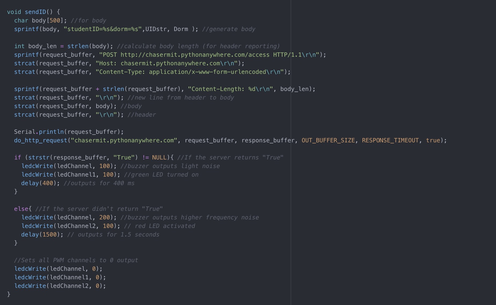

<meta charset="utf-8" emacsmode="-*- markdown -*-"><link rel="stylesheet" href="https://casual-effects.com/markdeep/latest/website.css?">

# Automated Dorm Visit System for MIT Halls

# Overview
For our project, we developed a system to automate the dorm sign-in and visit process at different MIT dorms around campus. In our dorms, we often saw people waiting in the lobby for long periods of time waiting to be tapped in. We were motivated to change the status-quo with the dorm sign-in process and created a novel system to check in students quicker, easier, and more efficiently. I have also included a detailed overview of the various steps we followed during the project, and the theory behind each of those steps.

# Features
Here is a video showing some potential user journeys with our device in the dorm:
https://youtu.be/oHhkBkmZahI

# Hardware

## Functional Block Diagram

The MFRC522 RFID reader detects and reads an ID card within its range, sending the information to the ESP32, which parses and encrypts data from the card. The ESP32 then sends that data to the server, which returns a response determining whether the student has access to the dorm. The piezo buzzer and LEDs provide sensory feedback about access to the dorm. The ESP32 is conencted to a battery board that is powered by a battery. We envision our system being used by charging the battery with power from a wall socket consistently while the battery powers the system.

## Extra Parts
- MFRC522: RFID reader used to read the data from the MIT ID cards.
- Piezo buzzer: Used to provide auditory feedback to both student and security worker.
- Red LED: Used to indicate to the student that he/she cannot enter the dorm.
- Green LED: Used to indicate to the student that he/she can enter the dorm.

## Power

The power strategy for the tap in system is simple. Since the device is stationary, the device can simply be plugged into a wall outlet. The wall outlet is plugged into the charging port of the battery board, and the battery board is plugged into the ESP. This way, the ESP is constantly running, but if the power in the outlet goes down, the battery pack is directly and automatically used to power the ESP system. In testing, it was found that the tap in system could run on strictly battery power for 7 hours (with a card-tap rate of approximately 5 taps per hour). The RFID reader draws about 30mA while running but has a sleep current of near 0. It is possible then that the 7-hour timeframe could be improved by implementing an improved sleep mechanism for the RFID reader, so that it doesn’t draw 30mA constantly. However, since the system is constantly plugged into a power outlet, there should be no significant issues with the reader drawing too much power, even if it is constantly running at 30mA.

# Arduino-Side

- When the system is idle, it waits for the RFID reader to detect an ID card within its range.
- When a new card is detected, the system will read the UID (unique ID number) from the raw data in the card, and it will encrypt it using AES encryption.
- Once encrypted, it will send a POST request to the server to determine if the UID of the card has access to the dorm.
- If "True" is returned, the buzzer buzzes for 400 milliseconds and the green LED lights, and, if "False" is returned, the buzzer buzzes for 1500 milliseconds and the red LED blinks. Then, the sytem returns to its idle state.

# Code Explanation

## setup():

- Sets up RFID reader, PWM channels (red LED, green LED, buzzer), and connects to the Wifi.

## loop():

- The code loops and continuously checks if a new RFID card has been scanned
- If a new card has been scanned, the returned bytes are converted into an integer ID
- Question marks are then appended onto the end of the ID until the ID is 16 characters long. This is to pad for the encryption, which requires inputs to be a multiple of 16
- The length 16 padded ID is then encrypted and stored in hexadecimal format
- The function sendID() is then called

## sendID():
- The ID stored in the UIDstr variable (which will be the hex encrypted ID at this point) and the Dorm are added to the POST body
- The request is then sent to the server
- The server will either return True (which triggers a small beep and the green LED), or something else (which triggers a long beep and the red LED)

# Server-Side

## High-level

The server side was programmed in Flask, which a lightweight Python web library. The database is SQLite3. The Boostrap framework was used from CSS/JS capabilities and styling.

The application is comprised of seven pages: home, login, sign up, dashboard, add a guest, information editing, and the guest worker flow.

The home page is where a student would land. They'd be presented with two buttons, login and sign up. Upon clicking sign up, they'd be presented with a HTML form that consists of relevant parameters. Submitting it sends a POST request that enters the parameters as a new entry row into the students database.

Upon signing up, users can then login. The login form takes a Kerberos and hashed student ID, which then performs a check on the backend to verify the entry exists and the details are corrected. After that, they're passed to the dashboard.

The dashboard contains their running guest list, the ability to remove guests from the list, a link to update their dorm, and a link to add a guest.

Lastly, there's the guest worker flow which performs a GET request to an endpoint that runs a `SELECT *` query on the database's "accesses" and populates the page with the entries in descending order.

The database is comprised of three tables: students (which contains student entries and their information), connections (which represents a one-directional guest list relationship), and accesses.

Student columns consist of Kerberos, hashed ID, dorm, first name and last name. Connections contains two informational columns, the first being the database ID of the user whose guest list is in question and the second being the database ID of the individual on that guest list.

Accesses contains information about the reuqesting user (namely ID, first name, last name, Kerberos) and, of course, time of entry.

# Encryption

## Motivation

On the ESP side of the system, the only piece of data collected from an ID tap is the user’s hashed ID number. To make the project more versatile to application in a campus-wide system, we decided to encrypt the data going from the ESP to the server. We wanted to protect, the potentially sensitive information [^syntax] of the identity of individuals visiting dorms from man-in-the-middle attacks betweent the ESP and the server.

## Implementation One: Vigenere Cipher

Our first implementation of an encryption cipher was the vigenere cipher for encrypting ID numbers on the ESP side and decrypting them on the server. The plaintext is taken in to the vignere cipher and shifted with a traditional Caeser Cipher method. However, the security upgrade comes from the nonuniform shift of the each plaintext characters; they are shifted based on the decimal representation of a predetermined key.

Below is a screenshot of the ESP-side code used to encrypt using a Vigenere Cipher. The ciphertext is sent to the server and decrypted to match users with their ID in the database.

On the serverside the ciphertext is decrypted using on the same agreed upon keyword and reversing the direction of the shift in the alphabet. This can be used to store the student’s ID in the database so that it can match with ID numbers inputted in the webform.

Below is a screeenshot of the python decryption functions used in companion with the cipher Arduino code. In both the .ino and .py implementations, the keyword for encryption and decryption is decided preimplementation.

### Drawbacks

Although we first wanted to implement the Vignere Cipher, the encryption scheme was too basic for our implementations. With a brute force approach, the keyword could be cracked allowing potentially sensitive data to be read before going into the database.

## Implementation 2: Advanced Encryption Standard (AES)

With the second implementation, we decided to use another symmetric key algorithm known as the Advanced Encryption Standard (AES). We implemented a 128 bit AES encryption scheme in the Electronic Codebook (ECB) method. In this method, the plaintext if first broken up into 16 byte blocks that are each decoded individually. It is a symmetric system that uses the same key for both encrypting and decrypting messages on the server and arduino sides.

Once the main 16 byte key is decided, it is stored as a 16 byte (4x4) array with each byte representing a word. Next, the 16-byte key is expanded into 44 subkeys with an objective. Sets of 4 subkeys are used in each of the ten round of the encryption (four in each of 10 rounds) and four in the pre-round step. The first 16-byte block is taken from the plaintext and the XOR operation is used between each collumn in the plaintext array and the corresponding subkey.

## Round Operations

Flow diagram for round operations. In our 128 bit encryption, 10 rounds were used.

In our 128-bit system a set of functions are preformed once in each of 10 rounds to encrypt the data. The original plaintext array is modified in each of these steps and is referred to as a State Array in the intermediate steps before becoming the final cipher text array

In each round, the Substitution Bytes or SubBytes operation (the first step) involves breaking up each byte into its first four and last four bits. The first four bits are converted into a decimal number from 0 to 15 and the last four numbers are converted to a decimal. The two numbers give a row and collumn location in a predefined matrix. The byte is substituted by the value at this matrix position. This matrix is known as an S-box and is agreed upon beforehand with the key.

The next operation is the Shift Row operation which shifts the bytes in the State Array depending on the row number; Row zero is not shifted while rows one, two, and three are shifted one, two, and three bytes respectively to the left. This creates a further encrypted matrix with shifted rows. The diagram below shows a sample state matrix a and the associatied scrambling after the Shift Row Operation.

Next, the state array undergoes the mix collumn step to further encrypt the data. In this step, each collumn (4 bytes) is multiplied by the Circulant MDS Matrix to diffiuse the data. The matrix maximizes the diffusion of the data bytes multiplied in. Below the r vector represents the result and the a vector represents a collumn from the status array.

Finally, in the AddRoundKey step the 4 subkeys used in the round are combined with the status matrix. Each collumn of the state array is comined with a collumn from the key using an xor operation.

## Padding

The 128 bit implementation of AES require each block size to be 16 bytes long. Before encrypting the data, we padded the array with extra information to make each string length 16 characters. On the decryption side, we also had to remove these paddings from the array before using the plaintext.

## Coded Examples

On the server side, we used a function with the symmetric key and ciphertext as parameters. We imported the Crypto.Cipher module and used the mbedtls module and AES library which completes the AES (ECB) encryption.
Server side decryption function for AES.

On the arduino side, we used the same symmetric key to encrypt the data before sending it. We utilized AES lib
Arduino-side encryption for AES.

# Design Challenges and Decision-Making

Because the MIT ID cards function at a specific frequency, we used the MFRC522 RFID reader as it functioned at the 13.56MHz frequency that the ID cards functioned on. Since the raw data in the ID card had the hashed version of student’s ID numbers and we could not gain access to the hashing function for security reasons, we designed our system to use the hashed number as the student’s actual ID number. And, since our system sends the hashed ID number from the ESP32 to the server, to enhance security, we used AES (Advanced Encryption Standard) encryption to encrypt the number being sent over the network. Using AES encryption was very challenging to implement, particularly encrypting C++ on the ESP32 while being able to decrypt in Python on the server, but it was well worth the efforts as it is ore secure than likes of the Vigenere Cipher. Our implementation of the encryption is discussed in more detail in that section.

Since we wanted our system to mimic the complete tap-in experience, which includes dorm residents tapping their IDs to gain access to their own dorms, we allowed users to be on their own guest lists to create the experience of them having access to their own dorms. We wanted both students and security workers to receive feedback after a student tapped their IDs, so we set up two interfaces of feedback. The first one, on the student side, is compromised of a buzzer, which buzzes longer when access is denied, and green and red LEDs, which blink when the student can and cannot, respectively, enter the dorm.  The second interface, on the security worker’s side, is a website since they already have monitors at their desk. The website displays the name, ID number, and kerberos of the student that entered the dorm, allowing the workers to know who’s entering the dorm.

As the system is intended to be functional 24/7 and will by the front desk of dorms, the system will be powered by a [insert type] battery, which will be consistently charged through a wall socket. This way, it is powered throughout the day, but can still function in case of power cuts. Our power management and findings are touched upon more in that section.

# Credits

We'd like to thank the entire 6.08 staff for their support, encouragement, and constructive feedback throughout the course and the final project. We would be remiss if we did not call to attention the efforts of our project mentors who kept us on track weekly as well as Joe Steinmeyer for his guidance.
